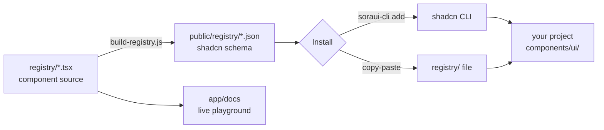

<div align="center">
  

  # Sora UI

  **Skeuomorphic, copy-paste React components for Next.js + Tailwind CSS.**

  <p>
    <a href="https://github.com/k4ran909/Sora-UI/stargazers"></a>
    
    
    
    <a href="https://github.com/k4ran909/Sora-UI/blob/main/CONTRIBUTING.md"></a>
    
  </p>

  <a href="https://sora-ui-plum.vercel.app"><strong>Live Demo</strong></a> ·
  <a href="https://sora-ui-plum.vercel.app/docs"><strong>Docs</strong></a> ·
  <a href="#-components">Components</a> ·
  <a href="#-contribution-roadmap">Roadmap</a> ·
  <a href="#-quick-start">Quick Start</a>

  <br /><br />

  <a href="https://www.producthunt.com/products/sora-ui-2?utm_source=badge-featured&utm_medium=badge&utm_campaign=badge-sora-ui-2" target="_blank"></a>
</div>

> [!NOTE]
> **🚀 We're live on Product Hunt!**
> If you love tactile interfaces and the web design of the skeuomorphic era, an [upvote on Product Hunt](https://www.producthunt.com/products/sora-ui-2) and a ⭐ star here go a long way. Curious to contribute? Check out the [Contribution Roadmap](#-contribution-roadmap)!

---

Tactile, animated UI you **own**. No package dependency — the source lands in your repo, so you can restyle and rewrite it freely. Installs through the shadcn CLI registry (aliases and deps resolved for you) or plain copy-paste.

## 🧩 Components

| Component | Description | Install |
|---|---|---|
| 📀 **Music Player** | Skeuomorphic CD player with morphing track-change animation + optional Spotify metadata | `npx soraui-cli add music-player` |
| 🌑 **Dark Player** | Dark pill player with a rolling track list and spinning disc | `npx soraui-cli add dark-player` |
| 📊 **Bar Visualizer** | Voice-agent frequency bars with live `MediaStream` + state animations | `npx soraui-cli add bar-visualizer` |
| 📅 **Date Selector** | Tactile week strip with a glowing active-day indicator | `npx soraui-cli add date-selector` |
| 🌐 **Dust Sphere** | Three.js particle globe that reacts to mic input | `npx soraui-cli add dust-sphere` |
| 📝 **Transcript Viewer** | Word-level transcript synced to audio, with click-to-seek and TTS fallback | `npx soraui-cli add transcript-viewer` |

## ⚡ Quick Start

```bash
# If your project uses shadcn/ui — resolves aliases + deps automatically
npx soraui-cli add music-player
```

Or copy a file from [`registry/`](registry/) manually, then install its deps and add the `cn` helper:

```bash
npm install framer-motion lucide-react clsx tailwind-merge   # + three (dust-sphere)
```

```ts
// lib/utils.ts
import { type ClassValue, clsx } from "clsx";
import { twMerge } from "tailwind-merge";

export const cn = (...inputs: ClassValue[]) => twMerge(clsx(inputs));
```

```tsx
import { MusicPlayer } from "@/components/ui/music-player";

<MusicPlayer timelineColor="#5e6ad2" defaultVolume={80} loop />
```

> Optional: pass `spotifyToken` + `trackIds` to pull real track metadata. Mint tokens **server-side** — see [`app/api/spotify/token/route.ts`](app/api/spotify/token/route.ts). Without them, the player falls back to bundled demo tracks.

## 🏗 How It Works



The `registry/` files are the single source of truth. A `prebuild` hook (`scripts/build-registry.js`) compiles them into shadcn-compatible JSON that the CLI serves, while the docs site renders the same files as live previews.

## 🛠 Local Development

```bash
git clone https://github.com/k4ran909/Sora-UI.git
cd Sora-UI && npm install && npm run dev   # → http://localhost:3000
```

```
registry/          Component source (what gets installed)
public/registry/   Generated shadcn JSON  ← scripts/build-registry.js
app/docs/          Docs site + playground
cli/               soraui-cli npm package
```

## 🤝 Contributing & Community

Sora UI is **open for contributions**! Whether you want to add new skeuomorphic widgets, fix bugs, improve dynamic documentations, or suggest designs, we would love your help.

### 🗺️ Contribution Roadmap
Here are some interactive skeuomorphic elements that would fit perfectly into the Sora UI registry:
*   **🎛️ Vintage Synthesizer Knobs:** Rotary dials with spring drag physics and surrounding LED lights.
*   **📟 Segmented LCD Display:** Glowing screens showcasing numerical feeds or mini retro graphs.
*   **🔌 Patch Cables & Toggle Switches:** 만족스러운 스위치(tactile flipping switches) and drag-and-drop audio cords.
*   **📼 Retro Cassette Deck:** Spinning spools that respond to audio playback.
*   **🎚️ Needle VU Meters:** Responsive needle meters showcasing volume signals.

To get started:
1. Review the [Code of Conduct](CODE_OF_CONDUCT.md) to understand our community guidelines.
2. Read the step-by-step [Contributing Guide](CONTRIBUTING.md) to set up your local development workspace and register your components.
3. Propose a new UI asset using our [New Component Proposal](https://github.com/k4ran909/Sora-UI/issues/new?template=new_component_proposal.md) issue template.

---

## 📄 License

[MIT](LICENSE) © Sora UI

<div align="center">
  <sub>Built with 🖤 for developers who miss when interfaces had texture.</sub>
</div>
